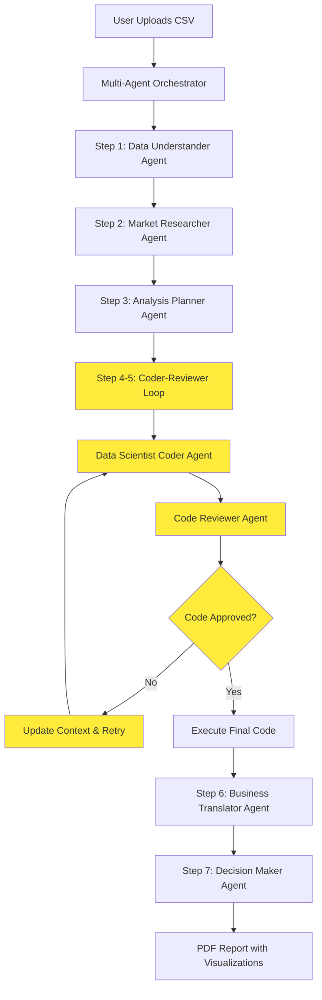

# 🤖 Multi-Agent Analytics System

**An intelligent AI-powered data analytics platform that autonomously analyzes datasets using specialized AI agents with advanced prompt engineering protocols.**

## ⚠️ IMPORTANT DISCLAIMER

**🚨 EDUCATIONAL PURPOSE ONLY - USE AT YOUR OWN RISK**

This project is developed **exclusively for educational and learning purposes**. It demonstrates AI agent architecture, data science techniques, and software engineering principles for academic study.

### ⚠️ Critical Warnings:

- **AI Outputs May Be Misleading**: The AI agents generate analysis based on patterns in training data and may produce inaccurate, biased, or incorrect results
- **No Professional Advice**: This system does NOT provide professional business, financial, medical, or legal advice
- **User Responsibility**: Any actions taken based on the system's outputs are **entirely the user's responsibility**
- **No Warranties**: The system is provided "as-is" without any guarantees of accuracy, reliability, or fitness for any purpose
- **Experimental Technology**: This is experimental AI technology that may contain bugs, errors, or unexpected behaviors
- **Data Privacy**: Users are responsible for ensuring their data privacy and compliance with applicable regulations

### 🎓 Educational Context:
This project showcases:
- Multi-agent AI system design
- Prompt engineering techniques  
- Data science workflow automation
- Software architecture patterns
- Academic research methodologies

**By using this system, you acknowledge and accept full responsibility for any consequences of your actions based on its outputs.**

---

[](https://python.org)
[](https://jupyter.org)
[](https://openrouter.ai)
[](LICENSE)

## 📋 Table of Contents

- [Overview](#overview)
- [Key Features](#key-features)
- [System Architecture](#system-architecture)
- [Tech Stack](#tech-stack)
- [Installation & Setup](#installation--setup)
- [Usage Guide](#usage-guide)
- [Agent Protocol Overview](#agent-protocol-overview)
- [Dataset Support](#dataset-support)
- [Example Workflow](#example-workflow)
- [Learning Outcomes](#learning-outcomes)
- [Contributing](#contributing)
- [License & Credits](#license--credits)

## 🎯 Overview

The Multi-Agent Analytics System represents a breakthrough in automated data analysis, combining the power of multiple specialized AI agents to deliver comprehensive insights from raw datasets. This system demonstrates advanced prompt engineering, chain-of-thought reasoning, and autonomous workflow orchestration.

### Why This Project Matters

As a student project, this system showcases:
- **Advanced AI Integration**: Multiple specialized agents working in harmony
- **Professional Development**: Enterprise-level code architecture and error handling
- **Educational Value**: Comprehensive learning in AI, data science, and software engineering
- **Real-World Application**: Practical solution for automated business intelligence

## ✨ Key Features

### 🧠 **Intelligent Agent Ecosystem**
- **7 Specialized AI Agents** working collaboratively
- **Advanced Prompt Engineering** with chain-of-thought reasoning
- **Autonomous Workflow Orchestration** with error recovery
- **Iterative Code Generation** with quality assurance

### 📊 **Comprehensive Data Analysis**
- **Multi-format Dataset Support** (CSV, Excel, JSON)
- **High-Volume Data Handling** with intelligent sampling
- **Statistical Analysis** with automated visualization
- **Business Intelligence Translation** for non-technical stakeholders

### 🎨 **Professional Output Generation**
- **Automated PDF Report Generation** with visualizations
- **Interactive Jupyter Interface** with progress tracking
- **Real-time Market Research** integration
- **Executive Summary** with actionable insights

### 🔧 **Enterprise-Grade Features**
- **Robust Error Handling** with exponential backoff
- **Rate Limiting Protection** for API calls
- **Memory Management** for large datasets
- **Quality Assurance** with automated code review

## 🏗️ System Architecture



### Agent Specialization Matrix

| Agent | Role | Expertise | Output |
|-------|------|-----------|--------|
| **Data Understander** | Senior Data Analyst | Data profiling, statistical analysis | Data quality assessment |
| **Market Researcher** | Market Research Specialist | Competitive intelligence, industry trends | Market context & opportunities |
| **Analysis Planner** | Data Science Strategist | Statistical methodology, project management | Comprehensive analysis plan |
| **Data Scientist Coder** | Senior Data Scientist | Python programming, ML, visualization | Executable analysis code |
| **Code Reviewer** | Code Quality Specialist | Code review, debugging, best practices | Quality assurance feedback |
| **Business Translator** | Business Intelligence Expert | Technical-to-business translation | Actionable business insights |
| **Decision Maker** | Senior Business Analyst | Business intelligence, report generation | Executive summary & recommendations |

## 🛠️ Tech Stack

### **Core Technologies**
- **Python 3.8+** - Primary programming language
- **Jupyter Notebook** - Interactive development environment
- **Pandas & NumPy** - Data manipulation and analysis
- **Matplotlib & Seaborn** - Data visualization
- **Plotly** - Interactive visualizations

### **AI & API Integration**
- **OpenRouter API** - Multi-model AI access (GPT-4, Claude, DeepSeek)
- **Brave Search API** - Real-time market research
- **Advanced Prompt Engineering** - Chain-of-thought reasoning protocols

### **Report Generation**
- **ReportLab** - Professional PDF generation
- **IPython Widgets** - Interactive user interface
- **Custom Styling** - Professional document formatting

### **Data Processing**
- **CSV/Excel Support** - Multi-format data ingestion
- **High-Volume Handling** - Intelligent sampling and memory management
- **Statistical Libraries** - SciPy, Scikit-learn integration

## 🚀 Installation & Setup

### Prerequisites
- Python 3.8 or higher
- Jupyter Notebook or JupyterLab
- OpenRouter API key
- Brave Search API key (optional)

### Step 1: Clone the Repository
```bash
git clone https://github.com/yourusername/multi-agent-analytics.git
cd multi-agent-analytics
```

### Step 2: Install Dependencies
```bash
pip install -r requirements.txt
```

Or install manually:
```bash
pip install openai requests pandas numpy matplotlib seaborn plotly scipy scikit-learn ipywidgets reportlab
```

### Step 3: API Key Setup
1. Get your OpenRouter API key from [OpenRouter.ai](https://openrouter.ai)
2. (Optional) Get your Brave Search API key from [Brave Search API](https://brave.com/search/api/)

### Step 4: Launch the System
```bash
jupyter notebook AI_analyzer.ipynb
```

## 📖 Usage Guide

### Quick Start
1. **Open the Jupyter Notebook** (`AI_analyzer.ipynb`)
2. **Enter API Keys** in the interface
3. **Select AI Model** (GPT-4o-mini recommended)
4. **Upload CSV Files** using the file upload widget
5. **Click "Run Multi-Agent Analysis"**
6. **Wait for completion** (progress bar shows 7 steps)
7. **Download PDF Report** with comprehensive analysis

### Supported Data Formats
- **CSV Files** - Primary format with automatic detection
- **Excel Files** - .xlsx format support
- **Large Datasets** - Intelligent sampling for high-volume data
- **Mixed Data Types** - Automatic type detection and handling

### Example Datasets Included
- **E-commerce Data**: Products, orders, customers
- **Tourism Analytics**: Tourist spending, accommodation data
- **Healthcare Data**: Diabetes monitoring, sensor data
- **Educational Data**: Student performance metrics

## 🔄 Agent Protocol Overview

### Workflow Execution Flow

```python
# Sequential 7-Step Process:

# Step 1: Data Understanding
data_insights = data_understander.execute(csv_data)

# Step 2: Market Research (uses data_insights)
market_insights = market_researcher.execute(data_insights)

# Step 3: Analysis Planning (uses both previous outputs)
analysis_plan = planner.execute(data_insights, market_insights)

# Steps 4-5: Iterative Coder-Reviewer Loop (up to 5 iterations)
for iteration in range(max_iterations):
    # Generate code based on analysis plan
    code = coder.execute(analysis_plan, csv_data, iteration)
    
    # Test the generated code
    test_results = execute_analysis_code(code, test_mode=True)
    
    # If code executes successfully, break the loop
    if test_results["execution_status"] == "success":
        break
    
    # Otherwise, review the code and provide feedback
    review_feedback = reviewer.execute(code, analysis_plan, iteration)
    # Feedback is used in next iteration

# Execute final approved code
analysis_results = execute_analysis_code(final_code, test_mode=False)

# Step 6: Business Translation (uses analysis results)
business_insights = business_translator.execute(analysis_results, data_insights)

# Step 7: Final Report Generation (uses all outputs)
final_report = decision_maker.execute(all_outputs, analysis_results, business_insights)
```

### Prompt Engineering Protocols

The system uses advanced prompt engineering with:
- **System Prompts** - Role-specific instructions and context
- **Chain-of-Thought** - Step-by-step reasoning protocols
- **Context Management** - Memory and state persistence
- **Quality Assurance** - Output validation and refinement

## 📊 Dataset Support

### Data Volume Categories
- **Small Data** (< 1,000 rows) - Full dataset analysis
- **Medium Data** (1,000-10,000 rows) - Selective sampling
- **High-Volume Data** (> 10,000 rows) - Intelligent subsetting

### Automatic Data Handling
```python
# High-volume data handling example
if df.shape[0] > 10000:
    df_sample_1 = df.head(1000)      # First 1000 rows
    df_sample_2 = df.tail(1000)      # Last 1000 rows  
    df_sample_3 = df.sample(1000)    # Random sample
    df_numeric = df.select_dtypes(include=[np.number])
```

### Data Quality Assessment
- **Missing Value Analysis** - Comprehensive null detection
- **Data Type Validation** - Automatic type conversion
- **Statistical Profiling** - Distribution analysis
- **Outlier Detection** - Anomaly identification

## 💡 Example Workflow

### Input: E-commerce Dataset
```csv
Customer #,Invoice #,Item #,SalesQty
100022,INV-001321,CSD-11100103,15
100022,INV-001321,CSD-11100107,5
```

### Output: Comprehensive Analysis Report
1. **Data Understanding**: 1,000+ transactions across 50+ products
2. **Market Research**: E-commerce trends and competitive analysis
3. **Statistical Analysis**: Sales patterns, customer behavior, product performance
4. **Business Insights**: Revenue opportunities, inventory optimization
5. **Visualizations**: 5+ charts showing trends and patterns
6. **Executive Summary**: Actionable recommendations for business growth

### 📄 Sample Output Report
**See the complete example**: [`AI multi agents System output report example.pdf`](AI%20multi%20agents%20Sytem%20output%20report%20example.pdf)

This sample report demonstrates the full output of the Multi-Agent Analytics System, including:
- **Executive Summary** with key findings
- **Data Quality Assessment** and profiling
- **Market Research Integration** with industry insights
- **Statistical Analysis Results** with detailed metrics
- **Business Intelligence Translation** for stakeholders
- **Professional Visualizations** embedded in the report
- **Strategic Recommendations** with implementation roadmap

The report showcases the system's ability to transform raw data into professional, actionable business intelligence suitable for executive decision-making.

## 🎓 Learning Outcomes

### Technical Skills Developed
- **AI Agent Architecture** - Multi-agent system design
- **Prompt Engineering** - Advanced AI interaction techniques
- **Data Science Pipeline** - End-to-end analysis workflow
- **API Integration** - External service connectivity
- **Error Handling** - Robust system design principles

### Professional Competencies
- **Project Management** - Complex system orchestration
- **Quality Assurance** - Automated testing and validation
- **Documentation** - Professional report generation
- **User Experience** - Interactive interface design
- **Business Intelligence** - Technical-to-business translation

### Academic Achievements
- **Research Integration** - Market research and competitive analysis
- **Statistical Methodology** - Advanced analytical techniques
- **Visualization Design** - Professional chart and graph creation
- **Report Writing** - Executive-level communication skills

## 🤝 Contributing

### For Students & Learners
- **Fork the Repository** - Create your own version
- **Experiment with Agents** - Modify agent behaviors
- **Add New Features** - Extend functionality
- **Improve Documentation** - Enhance learning materials

### For Developers
- **Code Quality** - Follow PEP 8 standards
- **Testing** - Add unit tests for new features
- **Documentation** - Update README and docstrings
- **Performance** - Optimize for large datasets

### Contribution Guidelines
1. **Fork** the repository
2. **Create** a feature branch (`git checkout -b feature/amazing-feature`)
3. **Commit** your changes (`git commit -m 'Add amazing feature'`)
4. **Push** to the branch (`git push origin feature/amazing-feature`)
5. **Open** a Pull Request

## 📄 License & Credits

### License
This project is licensed under the MIT License - see the [LICENSE](LICENSE) file for details.

### Acknowledgments
- **OpenRouter** - Multi-model AI API access
- **Brave Search** - Real-time market research data
- **Jupyter Community** - Interactive computing platform
- **Python Data Science Stack** - Pandas, NumPy, Matplotlib, Seaborn

### Student Developer
**Nassir Abdulhamid Almotairi**  
*Data Science Student*  
*Advanced AI & Data Science Focus*

### Educational Context
This project was developed as part of advanced coursework in:
- Artificial Intelligence and Machine Learning
- Data Science and Analytics
- Software Engineering and System Design
- Business Intelligence and Analytics


